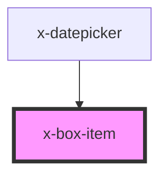

# x-box-item

<!-- Auto Generated Below -->

## Properties

| Property    | Attribute    | Description                                            | Type                                                      | Default     |
| ----------- | ------------ | ------------------------------------------------------ | --------------------------------------------------------- | ----------- |
| `alignSelf` | `align-self` |                                                        | `"baseline" \| "center" \| "end" \| "start" \| "stretch"` | `undefined` |
| `height`    | `height`     |                                                        | `string`                                                  | `undefined` |
| `sx`        | `sx`         | flex order flex-grow flex-shrink flex-basis align-self | `any`                                                     | `{}`        |
| `width`     | `width`      |                                                        | `string`                                                  | `undefined` |

## Dependencies

### Used by

 - [x-datepicker](../x-datepicker)

### Graph

----------------------------------------------

*Built with [StencilJS](https://stenciljs.com/)*
