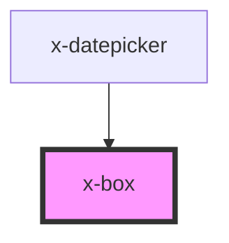

# x-box

<!-- Auto Generated Below -->

## Properties

| Property         | Attribute         | Description | Type                                                                                       | Default     |
| ---------------- | ----------------- | ----------- | ------------------------------------------------------------------------------------------ | ----------- |
| `alignContent`   | `align-content`   |             | `"center" \| "flex-end" \| "flex-start" \| "space-around" \| "space-between" \| "stretch"` | `undefined` |
| `alignItems`     | `align-items`     |             | `"baseline" \| "center" \| "end" \| "start" \| "stretch"`                                  | `undefined` |
| `direction`      | `direction`       |             | `"column" \| "column-reverse" \| "row" \| "row-reverse"`                                   | `undefined` |
| `gap`            | `gap`             |             | `string`                                                                                   | `undefined` |
| `height`         | `height`          |             | `string`                                                                                   | `undefined` |
| `inline`         | `inline`          |             | `boolean`                                                                                  | `undefined` |
| `justifyContent` | `justify-content` |             | `"center" \| "end" \| "space-around" \| "space-between" \| "space-evently" \| "start"`     | `undefined` |
| `sx`             | `sx`              |             | `any`                                                                                      | `{}`        |
| `width`          | `width`           |             | `string`                                                                                   | `undefined` |

## Dependencies

### Used by

 - [x-datepicker](../x-datepicker)

### Graph

----------------------------------------------

*Built with [StencilJS](https://stenciljs.com/)*
