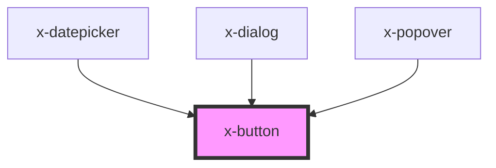

# x-button

<!-- Auto Generated Below -->

## Properties

| Property    | Attribute    | Description | Type                             | Default       |
| ----------- | ------------ | ----------- | -------------------------------- | ------------- |
| `allyLabel` | `ally-label` |             | `string`                         | `undefined`   |
| `border`    | `border`     |             | `string`                         | `undefined`   |
| `color`     | `color`      |             | `string`                         | `'secondary'` |
| `disabled`  | `disabled`   |             | `boolean`                        | `undefined`   |
| `elevated`  | `elevated`   |             | `boolean`                        | `undefined`   |
| `height`    | `height`     |             | `string`                         | `undefined`   |
| `name`      | `name`       |             | `string`                         | `undefined`   |
| `shape`     | `shape`      |             | `"circle" \| "pill" \| "soft"`   | `undefined`   |
| `type`      | `type`       |             | `"button" \| "submit"`           | `'button'`    |
| `value`     | `value`      |             | `string`                         | `undefined`   |
| `variant`   | `variant`    |             | `"none" \| "outline" \| "solid"` | `'solid'`     |
| `width`     | `width`      |             | `string`                         | `undefined`   |

## Dependencies

### Used by

 - [x-datepicker](../x-datepicker)
 - [x-dialog](../x-dialog)
 - [x-popover](../x-popover)

### Graph

----------------------------------------------

*Built with [StencilJS](https://stenciljs.com/)*
