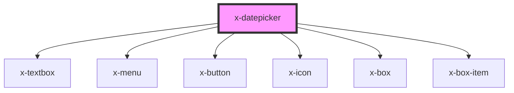

# x-datepicker

<!-- Auto Generated Below -->

## Properties

| Property      | Attribute     | Description | Type      | Default     |
| ------------- | ------------- | ----------- | --------- | ----------- |
| `description` | `description` |             | `string`  | `undefined` |
| `fieldId`     | `field-id`    |             | `string`  | `undefined` |
| `fieldName`   | `field-name`  |             | `string`  | `undefined` |
| `label`       | `label`       |             | `string`  | `undefined` |
| `month`       | `month`       |             | `number`  | `1`         |
| `readonly`    | `readonly`    |             | `boolean` | `undefined` |
| `required`    | `required`    |             | `boolean` | `undefined` |
| `value`       | `value`       |             | `string`  | `undefined` |
| `year`        | `year`        |             | `number`  | `2021`      |

## Events

| Event         | Description | Type                              |
| ------------- | ----------- | --------------------------------- |
| `valueChange` |             | `CustomEvent<{ value: string; }>` |

## Dependencies

### Depends on

- [x-textbox](../x-textbox)
- [x-menu](../x-menu)
- [x-button](../x-button)
- [x-icon](../x-icon)
- [x-box](../x-box)
- [x-box-item](../x-box-item)

### Graph

----------------------------------------------

*Built with [StencilJS](https://stenciljs.com/)*
