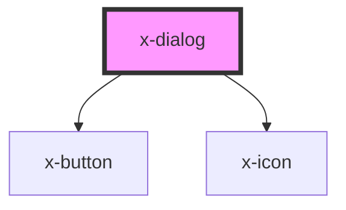

# x-dialog

<!-- Auto Generated Below -->

## Properties

| Property               | Attribute                | Description | Type      | Default     |
| ---------------------- | ------------------------ | ----------- | --------- | ----------- |
| `actionRequired`       | `action-required`        |             | `boolean` | `undefined` |
| `backdrop`             | `backdrop`               |             | `boolean` | `undefined` |
| `disableHeaderControl` | `disable-header-control` |             | `boolean` | `undefined` |
| `height`               | `height`                 |             | `string`  | `undefined` |
| `name` _(required)_    | `name`                   |             | `string`  | `undefined` |
| `open`                 | `open`                   |             | `boolean` | `undefined` |
| `width`                | `width`                  |             | `string`  | `undefined` |

## Events

| Event      | Description | Type                              |
| ---------- | ----------- | --------------------------------- |
| `dialogOn` |             | `CustomEvent<{ open: boolean; }>` |

## Dependencies

### Depends on

- [x-button](../x-button)
- [x-icon](../x-icon)

### Graph

----------------------------------------------

*Built with [StencilJS](https://stenciljs.com/)*
