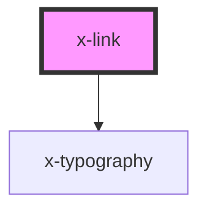

# x-link

<!-- Auto Generated Below -->

## Properties

| Property    | Attribute   | Description | Type                            | Default                |
| ----------- | ----------- | ----------- | ------------------------------- | ---------------------- |
| `download`  | `download`  |             | `boolean`                       | `undefined`            |
| `href`      | `href`      |             | `string`                        | `'javascript:void(0)'` |
| `stretch`   | `stretch`   |             | `boolean`                       | `undefined`            |
| `target`    | `target`    |             | `string`                        | `undefined`            |
| `text`      | `text`      |             | `string`                        | `undefined`            |
| `type`      | `type`      |             | `string`                        | `undefined`            |
| `underline` | `underline` |             | `"always" \| "hover" \| "none"` | `'none'`               |

## Events

| Event       | Description | Type               |
| ----------- | ----------- | ------------------ |
| `linkClick` |             | `CustomEvent<any>` |

## Dependencies

### Depends on

- [x-typography](../x-typography)

### Graph

----------------------------------------------

*Built with [StencilJS](https://stenciljs.com/)*
