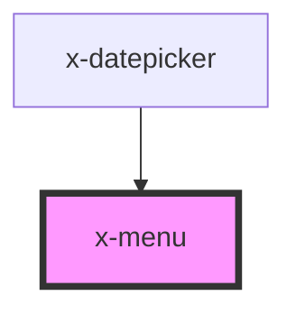

# x-menu

<!-- Auto Generated Below -->

## Properties

| Property     | Attribute    | Description | Type                                                                                                     | Default     |
| ------------ | ------------ | ----------- | -------------------------------------------------------------------------------------------------------- | ----------- |
| `activation` | `activation` |             | `"click" \| "hover"`                                                                                     | `"click"`   |
| `height`     | `height`     |             | `string`                                                                                                 | `undefined` |
| `open`       | `open`       |             | `boolean`                                                                                                | `false`     |
| `placement`  | `placement`  |             | `"bottom" \| "bottom-left" \| "bottom-right" \| "left" \| "left-top" \| "right" \| "right-top" \| "top"` | `'bottom'`  |
| `width`      | `width`      |             | `string`                                                                                                 | `undefined` |

## Dependencies

### Used by

 - [x-datepicker](../x-datepicker)

### Graph

----------------------------------------------

*Built with [StencilJS](https://stenciljs.com/)*
