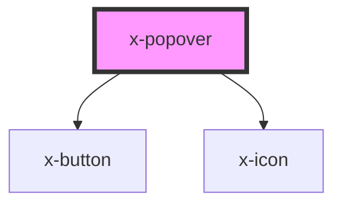

# x-popover

<!-- Auto Generated Below -->

## Properties

| Property    | Attribute   | Description | Type                                                                                                     | Default     |
| ----------- | ----------- | ----------- | -------------------------------------------------------------------------------------------------------- | ----------- |
| `height`    | `height`    |             | `string`                                                                                                 | `undefined` |
| `open`      | `open`      |             | `boolean`                                                                                                | `undefined` |
| `placement` | `placement` |             | `"bottom" \| "bottom-left" \| "bottom-right" \| "left" \| "left-top" \| "right" \| "right-top" \| "top"` | `'top'`     |
| `variant`   | `variant`   |             | `"elevation" \| "none" \| "outline"`                                                                     | `'outline'` |
| `width`     | `width`     |             | `string`                                                                                                 | `undefined` |

## Dependencies

### Depends on

- [x-button](../x-button)
- [x-icon](../x-icon)

### Graph

----------------------------------------------

*Built with [StencilJS](https://stenciljs.com/)*
