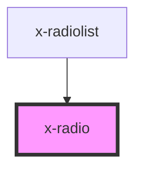

# x-radio

<!-- Auto Generated Below -->

## Properties

| Property               | Attribute  | Description | Type      | Default     |
| ---------------------- | ---------- | ----------- | --------- | ----------- |
| `checked`              | `checked`  |             | `boolean` | `undefined` |
| `fieldId` _(required)_ | `field-id` |             | `string`  | `undefined` |
| `label` _(required)_   | `label`    |             | `string`  | `undefined` |
| `value` _(required)_   | `value`    |             | `string`  | `undefined` |

## Events

| Event          | Description | Type                                                                                                 |
| -------------- | ----------- | ---------------------------------------------------------------------------------------------------- |
| `radioDidLoad` |             | `CustomEvent<{ label: string; value: string; host: HTMLXRadioElement; element: HTMLInputElement; }>` |
| `valueChange`  |             | `CustomEvent<{ value: string; }>`                                                                    |

## Dependencies

### Used by

 - [x-radiolist](../x-radiolist)

### Graph

----------------------------------------------

*Built with [StencilJS](https://stenciljs.com/)*
