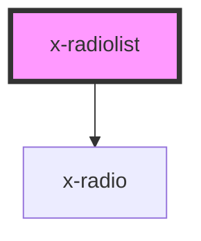

# x-radiolist

<!-- Auto Generated Below -->

## Properties

| Property                 | Attribute    | Description | Type                                                                     | Default     |
| ------------------------ | ------------ | ----------- | ------------------------------------------------------------------------ | ----------- |
| `fieldId`                | `field-id`   |             | `string`                                                                 | `undefined` |
| `fieldName` _(required)_ | `field-name` |             | `string`                                                                 | `undefined` |
| `items`                  | --           |             | `{ fieldId: string; label: string; value: string; checked: boolean; }[]` | `undefined` |
| `label`                  | `label`      |             | `string`                                                                 | `undefined` |
| `required`               | `required`   |             | `boolean`                                                                | `undefined` |
| `value`                  | `value`      |             | `string`                                                                 | `undefined` |

## Events

| Event         | Description | Type                              |
| ------------- | ----------- | --------------------------------- |
| `valueChange` |             | `CustomEvent<{ value: string; }>` |

## Dependencies

### Depends on

- [x-radio](../x-radio)

### Graph

----------------------------------------------

*Built with [StencilJS](https://stenciljs.com/)*
