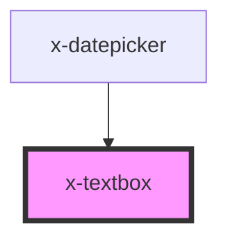

# x-textbox

<!-- Auto Generated Below -->

## Properties

| Property             | Attribute           | Description | Type                   | Default     |
| -------------------- | ------------------- | ----------- | ---------------------- | ----------- |
| `description`        | `description`       |             | `string`               | `undefined` |
| `fieldId`            | `field-id`          |             | `string`               | `undefined` |
| `fieldName`          | `field-name`        |             | `string`               | `undefined` |
| `format`             | `format`            |             | `string`               | `undefined` |
| `label` _(required)_ | `label`             |             | `string`               | `undefined` |
| `mask`               | `mask`              |             | `string`               | `undefined` |
| `maxLength`          | `max-length`        |             | `number`               | `undefined` |
| `overlayAlignment`   | `overlay-alignment` |             | `"left" \| "right"`    | `'left'`    |
| `readonly`           | `readonly`          |             | `boolean`              | `undefined` |
| `required`           | `required`          |             | `boolean`              | `undefined` |
| `type`               | `type`              |             | `"password" \| "text"` | `"text"`    |
| `value`              | `value`             |             | `string`               | `undefined` |

## Events

| Event         | Description | Type                           |
| ------------- | ----------- | ------------------------------ |
| `valueChange` |             | `CustomEvent<{ value: any; }>` |

## Methods

### `getNativeElement(callback?: (input: HTMLInputElement) => void) => Promise<unknown>`

#### Returns

Type: `Promise<unknown>`

## Dependencies

### Used by

 - [x-datepicker](../x-datepicker)

### Graph

----------------------------------------------

*Built with [StencilJS](https://stenciljs.com/)*
