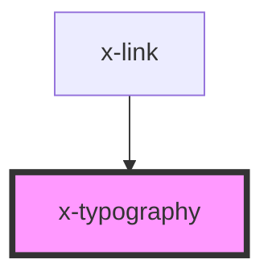

# x-typography

<!-- Auto Generated Below -->

## Properties

| Property  | Attribute | Description | Type                                                                                                                                             | Default     |
| --------- | --------- | ----------- | ------------------------------------------------------------------------------------------------------------------------------------------------ | ----------- |
| `color`   | `color`   |             | `string`                                                                                                                                         | `undefined` |
| `size`    | `size`    |             | `string`                                                                                                                                         | `undefined` |
| `sx`      | `sx`      |             | `any`                                                                                                                                            | `{}`        |
| `text`    | `text`    |             | `string`                                                                                                                                         | `undefined` |
| `variant` | `variant` |             | `"body1" \| "body2" \| "button" \| "caption" \| "h1" \| "h2" \| "h3" \| "h4" \| "h5" \| "h6" \| "link" \| "subtitle1" \| "subtitle2" \| "title"` | `undefined` |
| `weight`  | `weight`  |             | `string`                                                                                                                                         | `undefined` |

## Dependencies

### Used by

 - [x-link](../x-link)

### Graph

----------------------------------------------

*Built with [StencilJS](https://stenciljs.com/)*
